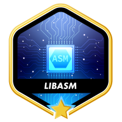

  
  

# Libasm

About:

This project aims to provide a hands-on learning experience for assembly language on the x86-64 architecture. It involves creating a library (libasm.a) containing implementations of common C functions in assembly code.

Install:

Libasm doesn't require a separate installation process. You'll build it from source code in your Linux development environment. Here's what you'll need:

    - GCC Compiler: GCC (GNU Compiler Collection) is necessary to compile the C test program that interacts with your assembly library. Ensure you have GCC installed on your system. You can typically install it through your Linux distribution's package manager (e.g., apt-get install gcc on Ubuntu/Debian).

    - NASM Assembler: Since your project uses NASM for compiling assembly files, you'll need NASM installed. You can usually install it using your package manager (e.g., apt-get install nasm on Ubuntu/Debian).

Building and Running:

    1. Clone or Download the Source Code: Obtain the Libasm source code (assuming it's in a Git repository). You can clone it using git clone <repository_url> or download the source files manually.
    2. Build the Library: Navigate to the Libasm source directory. The project should include a Makefile that defines the build process. Run make to compile your assembly files, create the Libasm library (libasm.a), and (optionally) build a sample C test program.
    3.  Write a C Test Program (Optional): If the project doesn't provide a sample test program, you can write your own C code that calls the functions from your library.
    4.  Compile and Link the Test Program (Optional): Use the Makefile or the GCC command to compile your C program and link it with the Libasm library. This generates the final executable program that you can run.

About assembly:

Assembly language acts as an intermediary between human-readable instructions and the raw machine code that computers understand directly. It offers a more low-level approach compared to high-level languages like C or Python.

Key Points:

Machine Code: Computers operate on instructions represented by binary digits (0s and 1s). This raw form, called machine code, is hard for humans to read and write.
Assembly Provides Readability: Assembly uses instructions that resemble natural language (e.g., mov for move, add for add) and abbreviations for memory locations (registers). It's still low-level but more understandable than machine code.
Assembly to Machine Code: An assembler program translates assembly language code into machine code that the computer can execute. It understands the assembly instructions and generates the corresponding binary opcodes.

About the lib: 

Libasm implements the following C functions in assembly language:

ft_strlen: This function calculates the length (number of characters) of a null-terminated string. It's the assembly equivalent of the standard C library function strlen.
ft_strcpy: This function copies a string from a source location to a destination location in memory. It's the assembly counterpart of the C library function strcpy.
ft_strcmp: This function compares two strings lexicographically (character by character). It fulfills a similar role to the C library function strcmp.
ft_write: This function writes data to a file descriptor. It's the assembly counterpart of the standard C system call write.
ft_read: This function reads data from a file descriptor. It's the assembly equivalent of the standard C system call read.
ft_strdup: This function allocates memory and copies a string, returning a pointer to the newly allocated memory containing the duplicated string. It's similar in functionality to the C library function strdup.